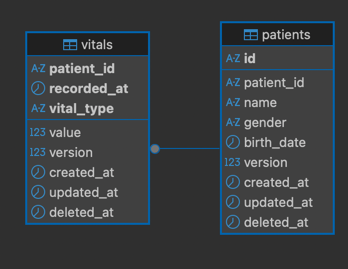

# Aitrics Vital Signs Project

Aitrics Vital Signs 프로젝트에 오신 것을 환영합니다. 이 프로젝트는 환자의 바이탈 데이터를 관리하고 분석하는 API 서버입니다.

## 🏗 프로젝트 패키지 구조

```text
.
├── api-server                # 메인 API 서버 애플리케이션
│   ├── app                   # 애플리케이션 레이어 (비즈니스 로직 및 핸들러)
│   │   ├── controller        # HTTP 요청을 처리하는 컨트롤러 레이어
│   │   ├── repository        # 데이터베이스 접근을 담당하는 레포지토리 레이어
│   │   ├── router            # API 엔드포인트 및 라우팅 설정
│   │   └── service           # 도메인 로직 및 서비스 로직 (Optimistic Lock 적용)
│   ├── cmd                   # 애플리케이션 진입점 (main.go 위치)
│   ├── ddl                   # 데이터베이스 테이블 정의 SQL 파일
│   ├── docs                  # Swagger API 문서 자동 생성 파일
│   ├── domain                # 도메인 모델 및 인터페이스 정의
│   └── internal              # 서버 내부 유틸리티 및 초기화 코드
├── library                   # 공통 공유 라이브러리 모듈
│   ├── envs                  # 환경 변수 설정 및 관리
│   ├── error                 # 공통 에러 핸들링 및 래핑 유틸리티
│   └── logger                # 정형화된 로깅 라이브러리
├── docker-compose.yaml       # 로컬 개발 및 테스트를 위한 인프라 구성
└── Dockerfile                # API 서버 컨테이너 빌드 정의
```

## 🚀 실행 방법

### 1. Docker Compose를 통한 실행 (권장)
가장 빠르고 간편하게 전체 시스템을 구동하는 방법입니다. MySQL 데이터베이스도 함께 설치 및 구성됩니다.
```bash
docker-compose up -d
```
* MySQL이 함께 컨테이너로 실행되며, 환경 설정이 자동으로 완료됩니다. 구동만 시키면 바로 테스트가 가능합니다.

### 2. 로컬 환경에서 직접 실행
Go 개발 환경에서 코드를 직접 수정하며 테스트할 때 사용합니다.
* **준비물**: 로컬 환경 혹은 외부의 `localhost:3306`에 MySQL이 실행 중이어야 합니다.
* **마이그레이션**: 별도의 DDL 실행 없이도 애플리케이션 구동 시 테이블이 자동으로 마이그레이션됩니다. (하지만 도커 환경에서 테스트하는 것을 가장 권장합니다.)
* **방법**: `api-server/example.env` 파일의 설정을 참고하여 환경 변수를 구성한 후 아래 명령어를 수행합니다.
```bash
cd api-server
go run cmd/main.go
```

### 3. 테스트 코드 실행
본 프로젝트는 코드 커버리지 70% 이상을 만족하도록 구성되었습니다.
테스트 수행을 위해 **반드시 `api-server` 디렉토리로 이동**해야 합니다.

```bash
cd api-server
```

* **Patient 도메인 테스트**
```bash
# api-server 디렉토리로 이동 후 실행
cd api-server && go test ./app/... -v -run Patient
```

* **Vital 도메인 테스트**
```bash
# api-server 디렉토리로 이동 후 실행
cd api-server && go test ./app/... -v -run Vital
```

* **Inference 도메인 테스트**
```bash
# api-server 디렉토리로 이동 후 실행 (Risk 계산 관련 테스트 수행)
cd api-server && go test ./app/... -v -run Risk
```

* **전체 테스트 실행**
```bash
# api-server 디렉토리로 이동 후 실행
cd api-server && go test ./...
```

## 📖 API 문서 (Swagger)

서버 구동 후 브라우저에서 아래 주소로 접속하여 API 사양을 확인하고 테스트할 수 있습니다.
* **Swagger URL**: [https://localhost:8080/swagger/index.html](https://localhost:8080/swagger/index.html)

## 🗄 데이터베이스 설계 (DDL)


데이터베이스 테이블 정의서는 아래 경로에서 확인할 수 있습니다.
* **Path**: api-server/ddl/aitrics_table.sql

> [!NOTE]
> `vitals` 테이블의 `patient_id`는 논리적으로 `patients` 테이블과 외래키(Foreign Key) 관계에 있지만, 실제 운영상의 데이터 관리 편의성과 유연성을 위하여 물리적인 외래키 제약 조건은 맺지 않았습니다.

## 🔐 Optimistic Lock (낙관적 락) 적용

본 프로젝트의 `VitalService`에는 데이터 정합성을 보장하기 위해 **Optimistic Lock** 기법이 적용되어 있습니다. 이는 데이터를 업데이트할 때 버전 번호를 체크하여 충돌을 방지하는 방식입니다.

### 동작 원리
1. 데이터를 조회할 때 현재의 `version` 값을 함께 가져옵니다.
2. 업데이트 요청 시, 클라이언트는 조회했던 `version` 값을 함께 전달합니다.
3. 서버는 전달받은 `version`이 현재 DB의 `version`과 일치하는지 확인합니다.
4. 일치하면 `version`을 1 증가시키며 업데이트를 수행하고, 다르면 **Conflict** 에러를 반환합니다.

### 흐름도 (Sequence Diagram)
```text
      Client A                Server/DB                Client B
         |                        |                       |
         |----(1) Read Record---->|                       |
         |      (Version: 1)      |                       |
         |                        |<---(2) Read Record----|
         |                        |      (Version: 1)     |
         |                        |                       |
         |---(3) Update Request-->|                       |
         |      (Version: 1)      |                       |
         |                        |                       |
         |<---(4) Success!------- |                       |
         |      (Version: 2)      |                       |
         |                        |---(5) Update Request--|
         |                        |      (Version: 1)     |
         |                        |                       |
         |                        |<---(6) Conflict! ---- |
         |                        | (DB Version is 2)     |
```
*상세 로직은 api-server/app/service/vital_service.go 를 참고하세요.*

## AI Agent 활용 기록
- ai-history/AITRICS.md 의 내용을 참고하도록 하였습니다.
- ai-history/history 에 CLAUDE 사용에대한 전반적인 내용이 기록되어 있습니다.
- api-server 하위 각 디렉토리에 CLAUDE.md 를 지정하고 각 레이어에 대한 코드 생성 규칙을 정의하였습니다.